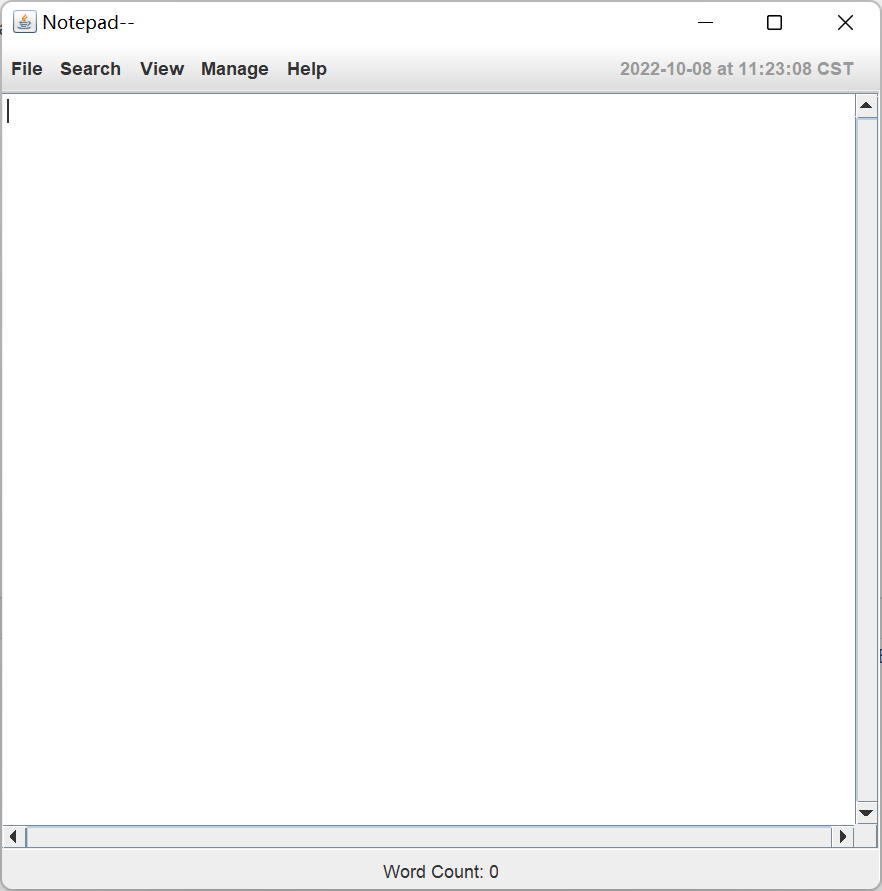

## Notepad--

<!--159.251 - Software Design and Construction-->

<!--Assignment 1 - 2022-->

<!--Using Java to make a text editor!-->

#### 1. Contributors

Member I : Zheng Wang, ID:

Member II : William Wu, ID: 21012743

#### 2. Instructions

1. First clone this repository into your local computer.

`git clone https://gitee.com/postlude/notepad.git`

2. You can open this project in any IDE. Run this maven project. When build succeeds, run the "notepad.class" and you will see the notepad program. Just like the one below.

   

   Files in the repository:

   1. YAML folder-- used to store the YAML configuration files.

   2. src folder-- includes the source codes and test codes and test resources

   3. pom.xml -- Maven configuration file

#### 3. Significant commits

Member I, Zheng Wang

Member II, William Wu

1. ID: 45dc09e1033eea96840d2385a314dbbdb32134a8

   Implemented two JUnit tests

2. ID: eb742f3ed80cea11bfa4fc63e6cd5ebb40e68172

   Using YAML to configure the project

3. ID: 9f74d8285eacc23b8a375499f8690ab4599ee0ad

   Implemented the functionality of reading RTF files

4. ID: 456db2abf6a1c0ddfc23a13427764655625a7fd4

   Implemented the functionality of reading ODT files

5. ID: aa53e04d4e81d1d14d17ec9d62f4f4ebe268e11e

   Implemented the save functionality

6. ID: a0977bb9019ef369b77521692d0fd206b628c3e6

   Implemented the new functionality

7. ID: 1500d09dfa41c8a30e77dbfce5f49085d8e822f2

   Implemented the export functionality

8. ID: e4173ebe2afae3f82e8312fd84310c5bb8a8218c

   Implemented the selectAll, copy and cut functionalities

9. ID: bae001fd30179eddbd60972a474df64405a9d2a5

   Implemented the print functionality

10. ID: 92d56a815bb95f6be21c76f1c5ece32f2ced7a9c

    Add YAML dependency

#### 4. Interesting features and something worth mentioning